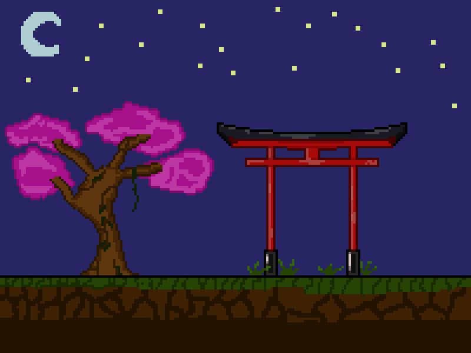

Indie, definetly not completed game. Idk if i will complete it.
Known issues:
- can't spam attack button
- not killing enemies (just not added)
- bat not configured very well ("escaping" from frame for a second from right side)
- basicly can't do anything fun yet
- at least cool looking :)

UPDATE 07.02.2025
I don't know why, but suddenly just before e.kill() enemy is being added to 224 different uknown groups and it crashes whole sprite system (:.

